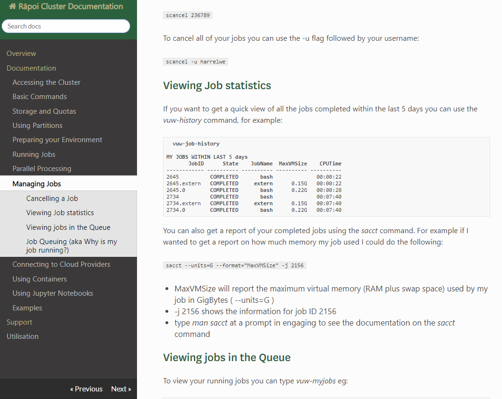

# Rāpoi-docs
Documentation for the Rāpoi cluster.

## Site configuration

Rāpoi docs pages are built using the <a href="http://127.0.0.1:8000">sphinx</a>-based <a href="https://docs.readthedocs.io/en/stable/intro/getting-started-with-sphinx.html">Read the Docs theme</a> and deployed via <a href="https://www.mkdocs.org/">MkDocs</a>. <br><a href="https://github.com/vuw-research-computing/raapoi-docs/blob/master/mkdocs.yml">```mkdocs.yml```</a> configures basic site information, page structure and table of contents depth, and can also customise <a href="https://www.mkdocs.org/user-guide/configuration/">other variables</a>. <a href="https://github.com/vuw-research-computing/raapoi-docs/blob/master/extra.css">```extra.css```</a> defines custom styling.

Rather than one scrolling page with clickable sections in the nav, the site is now configured so each ```.md``` file is its own page,  with heading levels in these markdown files creating sub-menu items. <br>
Currently, heading levels 1 and 2 (# and ##) create clickable menu items in the side nav bar:



This behaviour is controlled by the ```baselevel``` and ```toc_depth``` variables in ```mkdocs.yml```:
```
markdown_extensions:
  - toc:
      permalink: True
      baselevel: 1
      toc_depth: 3
```

This structure is designed to make the docs easier to navigate, providing a more granular menu which allows for more information to be added without effecting navigability too adversely. It makes browsing on mobile devices less cumbersome too, as the pages can be arrived at both by the collapsible mobile menu (in the top lef) and the ```Previous``` and ```Next``` breadcrumb buttons (at the bottom) of each page. The theme also has a useful ```Search``` built in by default. 


## Workflow for updating docs (locally via CLI):

1. Clone the <a href="https://github.com/vuw-research-computing/raapoi-docs">```raapoi-docs```</a> repo, open in the command line and make sure you're on the ```master``` branch.

1. Navigate to the ```docs``` folder and open and edit (or create) the appropriate ```.md``` file, (e.g. ```examples.md```).

1. Save once changes are made, then use <a href="https://git-scm.com/docs">```git```</a> to ```add```, ```commit```, and ```push``` to ```origin master```.

1. Now deploy this with MkDocs commands:

	```mkdocs build --clean``` <br>
	(This builds the markdown files into a ```/site``` folder, where each ```.md``` file creates a folder of the same name with its own ```index.html```). 
	<br>
	Note: ```clean``` overwrites and cleans existing ```/site``` directory. 

1. (Optional) To see changes locally, use ```mkdocs serve``` which should run and print something similar to: 
	```
	plummema@ITS-7MTSF2S MINGW64 /h/GIT_HUB/raapoi-docs (master)
	$ mkdocs serve
	INFO    -  Building documentation...
	INFO    -  Cleaning site directory
	[I 190619 12:41:14 server:298] Serving on http://127.0.0.1:8000
	```
	The local site is now viewable at <a href="http://127.0.0.1:8000">```http://127.0.0.1:8000```</a>. ```mkdocs serve``` supports real time previews, so any changes made and saved will update the local server automatically.

1. When ready to publish, use:
```mkdocs gh-deploy``` (optional ```--clean``` can be appended to deploy a clean version)

	This pushes changes from ```.md``` files to the relevant ```html``` pages in the ```/site``` folder of the repo's ```gh-pages``` branch. 
	Running the command should return something like: 
	```
	plummema@ITS-7MTSF2S MINGW64 /h/GIT_HUB/raapoi-docs (master)
	$ mkdocs gh-deploy
	INFO    -  Cleaning site directory
	INFO    -  Building documentation to directory: H:\GIT_HUB\raapoi-docs\site
	INFO    -  Copying 'H:\GIT_HUB\raapoi-docs\site' to 'gh-pages' branch and pushing to GitHub.
	INFO    -  Your documentation should shortly be available at: https://vuw-research-computing.github.io/raapoi-docs/
	```
1. Visit the <a href="https://vuw-research-computing.github.io/raapoi-docs/">live site</a> to check changes have propagated as expected, and make any 	     further adjustments by repeating above steps as required.

	That's it! If editing multiple files, a good option may be to make local changes on all the required files first, then these steps only need be worked through once. (The downside is you'll have less granular commit history and lose the ability to easily reverse some changes made).

	_Important note:_ the repo publishes docs from the ```gh-pages``` branch. Because we're using ```mkdocs gh-deploy```, it's important to refrain from editing in that branch, use the above workflow (i.e. editing ```.md``` files in ```master```) instead.

