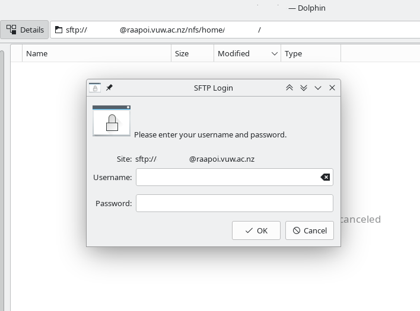

# Accessing the Cluster

To access Rāpoi, you'll first need to get an account provisioned for you by contacting the [Rāpoi support team](support.md) with your:

*  Full Name
*  VUW staff username
*  Faculty, School or Institute affiliation.

If you don't have a VUW staff account, it may still be possible to be given access - please [contact us](support.md) to determine options.

_Access is via SSH_

*  Hostname: raapoi.vuw.ac.nz
*  IP Address: 130.195.19.126
*  Port: 22
*  Username: Your VUW username
*  Password: Your VUW password

*NOTE:* A wired network connection or [VPN](https://vpn.victoria.ac.nz/+CSCOE+/logon.html#form_title_text) is required if
connecting from campus wifi or from off-campus. Some users have had issues with
using the hostname and instead need to use the IP address, eg
`harrelwe@130.195.19.126`

More information on VUW VPN services can be found [here](https://www.victoria.ac.nz/its/staff-services/core-tools-and-services/remote-access).

Here is a general overview of SSH [https://www.howtogeek.com/311287/how-to-connect-to-an-ssh-server-from-windows-macos-or-linux/](https://www.howtogeek.com/311287/how-to-connect-to-an-ssh-server-from-windows-macos-or-linux/).


### SSH Clients

_Mac OSX SSH Clients_

You can use the built-in Terminal.app or you can download iTerm2 or XQuartz. 
XQuartz is required to be installed if you wish to forward GUI applications (matlab, rstudio, xstata, sas, etc), aka X forwarding.

* Terminal.app is the default application for command-line interface
  * To login using the built-in Terminal.app on Mac, go to
    * Applications --> Utilities --> Terminal.app
    * Or use Spotlight search (aka Command-Space)
* [iTerm2](https://www.iterm2.com/) is a good replacement for the default Terminal app
* [XQuartz](https://www.xquartz.org/) is a Xforwarding application with its own terminal.  XQuartz can be used in conjuction with the Terminal.app for GUI apps.  NOTE: Mac users should run the following command: `sudo defaults write org.macosforge.xquartz.X11 enable_iglx -bool true`   We have found that this allows some older GUI applications to run with fewer errors.


NOTE:  Once at the command prompt you can type the following to login (replace "username" with your VUW user):

`ssh -X username@raapoi.vuw.ac.nz`

The _-X_ parameter tells SSH to forward any GUI windows to your local machine, this is called X forwarding.

_Windows SSH Clients_

* Recommended Clients:
  * [Git Bash](https://gitforwindows.org/) is a great option and is part of the Git for Windows project.  
  * [MobaXterm](https://mobaxterm.mobatek.net/) is a good option, especially if you require access to GUI applications such as MATLAB or xStata.  This also has a built-in SFTP transfer window.


### File Transfer with SFTP, SCP or rsync

__NOTE:__ Please do not perform massive data transfer on the login node. It is preferable to parallel transfer data as a slurm job on multiple compute nodes rather than on the login node.

There are many file transfer clients available for Mac, Windows and Linux, including but not limited to Free/OpenSource Desktop tools such as Filezilla, Cyberduck, Dolphin and proprietary/licenced offerings such as WinSCP, ExpanDrive, etc

One can also use built-in command-line tools on Linux, Mac and Windows (if running Git Bash or MobaXterm).  The most common command-line utilities are _scp, sftp_ and _rsync_. 

To copy a single file to or from the cluster, we can use _scp_ (“secure copy”). To upload to another computer, try:

``` text
[you@laptop:~]$ scp <file_name_to_transfer> <username>@raapoi.vuw.ac.nz:/nfs/home/<username>/<destination>
```

I would upload a file from my device(local) to Rāpoi(remote) using:

``` text
rohit@ava:~$ scp demo.tar.gz duggalro@raapoi.vuw.ac.nz:/nfs/scratch/duggalro/
```

_SFTP_ client can be also be set up. In the address bar of my file explorer, I can add the directory I wish to access in the form `sftp://<username>@raapoi.vuw.ac.nz:/nfs/home/<username>`. A dialog will appear to confirm my password to finally let me access the specific path.



In all cases you will need to supply the hostname or IP address of the cluster, see above.  You may also need to supply the port (22) and a path.  The paths that you will most likely use are your home or your scratch space:
_/nfs/home/username_ or _/nfs/scratch/username_


### File transfer with cloud tools

If you are using cloud storage such as AWS, DropBox, Cloudstor, GLOBUS please look at the examples we have in [Connecting to Cloud Providers](external/cloud_providers.md)


### Host Keys

An SSH host key identifies the server to your ssh client. They are an important security feature and not something you should just hit ENTER to accept.
The first time an SSH client connects to the server, it displays the servers public key fingerprint.

``` text
The authenticity of host 'raapoi.vuw.ac.nz (130.195.19.126)' can't be established.
ED25519 key fingerprint is SHA256:f+rhB7q5nt/HxcNK3qA8UfSdSJ7J05L1dU4C2fslkxg.
This host key is known by the following other names/addresses:
    C:\Users\username/.ssh/known_hosts:109: raapoi
Are you sure you want to continue connecting (yes/no/[fingerprint])?
```

Confirm that the finger print on the login server matches the appropriate fingerprint shown below and type 'yes'.

<!--
* Old Raapoi 130.195.19.14:

``` text
ssh-ed25519 255 SHA256:SFQSPRtu5o4cpj/CuS37DXzfrFyalMz1FA2NVmissxo
```
-->

* From August 2023 ("New Rāpoi" 130.195.19.126):

``` text
ssh-ed25519  256 SHA256:f+rhB7q5nt/HxcNK3qA8UfSdSJ7J05L1dU4C2fslkxg
ssh-ecdsa    256 SHA256:ChU88YMNnUiXWmQRV0cgeDdnUpsdybgF14Dk3KW3dr4
ssh-rsa     3072 SHA256:izq2NXKroc7gpu0vkWNQnXd4kmjk/pmrQw9vMvwAsIs 
```

#### Notes regarding old host keys

**IMPORTANT:**
If the host key does not match the one stored on your client, you will see a warning  (example below). 
The Raapoi login node was replaced in August 2023, if you had been using the previous login node you can expect to see this warning about the change of host key. 
Double check that the fingerprint matches one of the above before replacing the key stored in your client.

``` text
@@@@@@@@@@@@@@@@@@@@@@@@@@@@@@@@@@@@@@@@@@@@@@@@@@@@@@@@@@@
@    WARNING: REMOTE HOST IDENTIFICATION HAS CHANGED!     @
@@@@@@@@@@@@@@@@@@@@@@@@@@@@@@@@@@@@@@@@@@@@@@@@@@@@@@@@@@@
IT IS POSSIBLE THAT SOMEONE IS DOING SOMETHING NASTY!
Someone could be eavesdropping on you right now (man-in-the-middle attack)!
It is also possible that a host key has just been changed.
The fingerprint for the ED25519 key sent by the remote host is
SHA256:f+rhB7q5nt/HxcNK3qA8UfSdSJ7J05L1dU4C2fslkxg.
Please contact your system administrator.
Add correct host key in C:\\Users\\username/.ssh/known_hosts to get rid of this message.
Offending ED25519 key in C:\\Users\\username/.ssh/known_hosts:38
Host key for raapoi.vuw.ac.nz has changed and you have requested strict checking.
Host key verification failed.

```

To remove an old host key for raapoi.vuw.ac.nz cached on your client run the following:

``` bash
ssh-keygen -R raapoi.vuw.ac.nz
```

... and you could also run this to remove the IP address(s) for Rāpoi:

``` bash
ssh-keygen -R 130.195.19.14
ssh-keygen -R 130.195.19.126
```

If you remove all of these, on your next login you'll be asked to verify the fingerprint again, as illustrated above.
