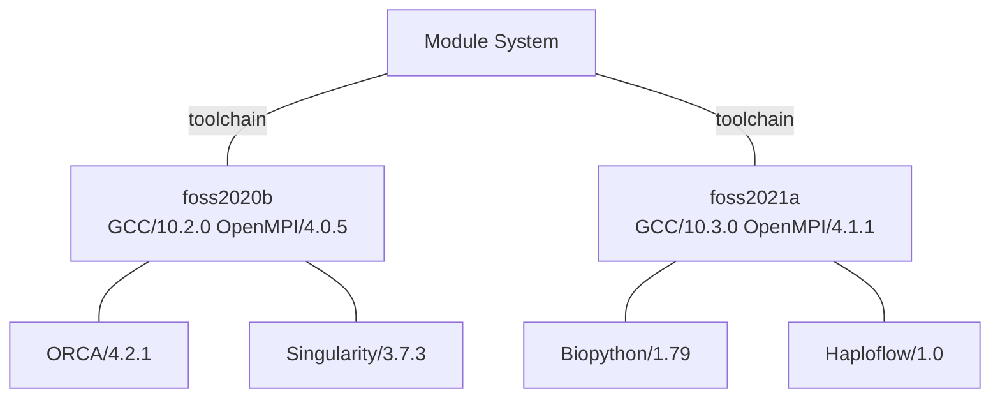

# Environment Setup
Rāpoi has an extensive library of applications and software available. There are numerous programming languages and libraries (R, Julia, Python, lua, OpenMPI, blas, etc) as well as dozens of applications (Matlab, Gaussian, etc).  We also keep older versions of software to ensure compatibility.

Because of this, Rāpoi developers use a tool called *lmod* to allow a user to load a specific version of an application, language or library and start using it for their work. The _module_ command will show you what software is available to load, and will add the software to your environment for immediate use. 

Entering `module help` into the command prompt will give you some basic information about all of the `module` sub-commands.
Here we briefly describe the most important ones.

## The current module system

Since 2020, Rāpoi software has been built and organised into modules using toolchains. Toolchains group software built with compatible compiler and MPI versions, keeping software in separate and reproducible environments.

Before software in a toolchain can be loaded, its compiler and MPI modules, or the corresponding toolchain module, must be loaded. For example, to load `BioPython/1.7.9`:

```bash
module load foss/2021a
module load BioPython/1.7.9
```

To save you needing to load both a Compiler and MPI version, the compiler and MPI versions are bundled into half yearly packs.  For example `GCC/10.3.0 and OpenMPI/4.1.1` are bundled in the meta module `foss/2021a`



<br/>

The toolchain can also be loaded as individual prerequisites. For example, `netCDF/4.7.1` requires `GCC/8.3.0` and `OpenMPI/3.1.4`:

```bash
module load GCC/8.3.0
module load OpenMPI/3.1.4
module load netCDF/4.7.1
```

Use `module spider <name>` to find available software and its prerequisites. Searches are case-sensitive.

### Toolchains

Common CPU toolchains include:

Toolchain  | Compiler   | MPI
:---------:|:----------:|:-------------:
foss/2020b | GCC/10.2.0 | OpenMPI/4.0.5
foss/2021a | GCC/10.3.0 | OpenMPI/4.1.1
foss/2021b | GCC/11.2.0 | OpenMPI/4.1.1
foss/2022a | GCC/11.3.0 | OpenMPI/4.1.4
foss/2022b | GCC/12.2.0 | OpenMPI/4.1.4
foss/2023a | GCC/12.3.0 | OpenMPI/4.1.5
foss/2023b | GCC/13.2.0 | OpenMPI/4.1.6
foss/2024a | GCC/13.3.0 | OpenMPI/5.0.3
foss/2025b | GCC/14.3.0 | OpenMPI/5.0.3

GPU CUDA toolchains available:

CUDA module | GCC version | NVCC version
:----------:|:-----------:|:------------:
CUDA/10.1.243 | GCC 8.5.0 | Not available
CUDA/11.1.1   | GCC 8.5.0 | Not available
CUDA/11.3.1   | GCC 8.5.0 | 11.3.109
CUDA/11.4.1   | GCC 8.5.0 | 11.4.100
CUDA/11.7.0   | GCC 8.5.0 | 11.7.64
CUDA/11.8.0   | GCC 8.5.0 | 11.8.89
CUDA/12.0.0   | GCC 8.5.0 | 12.0.76
CUDA/12.1.0   | GCC 8.5.0 | 12.1.66
CUDA/12.1.1   | GCC 8.5.0 | 12.1.105
CUDA/12.8.0   | GCC 8.5.0 | 12.8.61
CUDA/12.9.1   | GCC 8.5.0 | 12.9.86
CUDA/13.1.0   | GCC 8.5.0 | 13.1.80

Intel toolchains are available for software requiring Intel compilers or MKL.

Toolchain    | Compiler   | Intel Compiler | MPI           | MKL
:-----------:|:----------:|:--------------:|:------------:|:-------------:
intel/2021b  | GCC/11.2.0 | 2021.4.0       | impi/2021.4.0 | imkl/2021.4.0
intel/2022a  | GCC/11.3.0 | 2022.1.0       | impi/2021.6.0 | imkl/2021.6.0

---

## Searching for software packages

This section will give you a brief description on how to find which software packages are available and load them.

### Searching with `module avail`

To show all software available to load type the following:

  `module avail`

This is a long list of software packages which can each be loaded immediately (i.e. without first loading pre-requisites).
Generally each software package is listed as a path of the form *<software name>/<version number>*, e.g. _lua/5.3.5_.
The list is separated into a few sections (via lines of dashes).
The section of most interest has the heading
```bash
-------------------- /home/software/tools/eb_modulefiles/all/Core --------------------
```
The modules under this heading (or similar) are from the current module system.

There may be other sections, depending on what modules you already have loaded. For old module system before 2020, see [Old Modules](old_mod.md).

For example, if `GCC/10.3.0` is loaded then you will see the additional sections
```bash
------------ /home/software/tools/eb_modulefiles/all/Compiler/GCC/10.3.0 -------------
   Bio-SearchIO-hmmer/1.7.3    GEOS/3.9.1       Haploflow/1.0      OpenMPI/4.1.1
   Boost/1.76.0                GSL/2.7          OpenBLAS/0.3.15    Subread/2.0.3
   FlexiBLAS/3.0.4

---------- /home/software/tools/eb_modulefiles/all/Compiler/GCCcore/10.3.0 -----------
   Autoconf/2.71           (D)    Python/3.9.5                (D)    libevent/2.1.12
   Automake/1.16.3                Qhull/2020.2                       libfabric/1.12.1
   Autotools/20210128             RE2/2022-02-01                     libffi/3.3
   BLIS/0.8.1                     RapidJSON/1.1.0                    libgeotiff/1.6.0
   Bazel/3.7.2                    Rust/1.52.1                        libgit2/1.1.0
<etc. many more lines...>
```
These sections show various additional modules for which `GCC/10.3.0` is a pre-requisite.
Many pieces of software have one or more pre-requisites in the new module system.
A more convenient way to search for specific pieces of software, and determine what their pre-requisite modules are, is via the `module spider` command.

### Searching with `module spider`

Suppose you want to find out which Python versions are available, you can search via the command `module spider Python`, for example:

```bash
username@raapoi-login:~$ module spider Python

--------------------------------------------------------------------------------------
  Python:
--------------------------------------------------------------------------------------
    Description:
      Python is a programming language that lets you work more quickly and integrate 
      your systems more effectively.

     Versions:
        Python/2.7.15-bare
        Python/2.7.15
        Python/2.7.16
        Python/2.7.18
        Python/3.9.6
<additional output not included here>
```
Note that the capital **P** in `Python` is important here, the `module spider` command is case-sensitive. 
Use the capitalisation shown by `module spider` when loading software.

Among the list of Python versions is `Python/3.9.6`.
To find out how to load it we call `module spider` again with the specific Python version included, e.g.
```bash
username@raapoi-login:~$ module spider Python/3.9.6

--------------------------------------------------------------------------------------
  Python: Python/3.9.6
--------------------------------------------------------------------------------------
    Description:
      Python is a programming language that lets you work more quickly and integrate 
      your systems more effectively.


    You will need to load all module(s) on any one of the lines below before the "Python/3.9.6" module is available to load.

      GCCcore/11.2.0
      
<additional output not included here>
```

---

## Loading software packages

Loading a software package is done via the command `module load <package name>` where *<package name>* should generally include the version as well.

For example, the output of `module spider Python/3.9.6` (from above) tells us that in order to load this version of Python we must first load `GCCcore/11.2.0`. 
That is, we can load this version of Python via
```bash
username@raapoi-login:~$ module load GCCcore/11.2.0
username@raapoi-login:~$ module load Python/3.9.6
```
If we wanted to ensure we had a clean/minimal software environment, we could start with a purge (see below for details), that is 
```bash
username@raapoi-login:~$ module purge
username@raapoi-login:~$ module load config GCCcore/11.2.0
username@raapoi-login:~$ module load Python/3.9.6
```In either case, you will now be able to run Python version 3.9.6 by entering `python` at the command prompt.
If you are intending to do some computation, you should call `srun --pty python` to start an interactive job on the quicktest node running Python.


---

## Other useful module sub-commands


### Listing loaded modules

To see what modules you have loaded into your environment you can run the command:

`module list`  

By default you will have the config module loaded (which makes the *vuw-* commands available) and possibly several others. 
For example, here are the modules I have loaded in my environment when I login:

```bash
username@raapoi-login:~$ module list

Currently Loaded Modules:
  1) autotools   3) gnu9/9.4.0    5) ucx/1.11.2         7) openmpi4/4.1.1   9) config
  2) prun/2.2    4) hwloc/2.7.2   6) libfabric/1.13.0   8) ohpc

```

You can also check if a specific module is loaded via the command `module is-loaded <package name>`.


### The `module whatis` and `module show` commands

If you want to know more about a particular module you can use the _whatis_ or
_show_ subcommand.  
The output of _module whatis_ will be more details for some modules than others. 
Here is one example:

```bash
username@raapoi-login:~$ module whatis foss/2025b
foss/2025b          : Description: GNU Compiler Collection (GCC) based compiler toolchain, including
 OpenMPI for MPI support, OpenBLAS (BLAS and LAPACK support), FFTW and ScaLAPACK.
foss/2025b          : Homepage: https://docs.easybuild.io/common-toolchains/#common_toolchains_foss
foss/2025b          : URL: https://docs.easybuild.io/common-toolchains/#common_toolchains_foss
```

The output of _module show_ shows the help information associated with the module/package as well as various steps which are executed when the module is loaded.

```bash
username@raapoi-login:~$ module show GCC/14.3.0
------------------------------------------------------------------------------------------------------------------------
   /home/software/tools/eb_modulefiles/all/Core/GCC/14.3.0.lua:
------------------------------------------------------------------------------------------------------------------------
-- This help content will be processed as markdown in terminal display
help([[
Description
===========
The GNU Compiler Collection includes front ends for C, C++, Objective-C, Fortran, Java, and Ada,
 as well as libraries for these languages (libstdc++, libgcj,...).


More information
================
 - Homepage: https://gcc.gnu.org/
]])
whatis("Description: The GNU Compiler Collection includes front ends for C, C++, Objective-C, Fortran, Java, and Ada,
 as well as libraries for these languages (libstdc++, libgcj,...).")
whatis("Homepage: https://gcc.gnu.org/")
whatis("URL: https://gcc.gnu.org/")
conflict("GCC")
depends_on("GCCcore/14.3.0")
depends_on("binutils/2.44")
prepend_path("MODULEPATH","/home/software/tools/eb_modulefiles/all/Compiler/GCC/14.3.0")
setenv("EBROOTGCC","/home/software/EasyBuild/software/GCCcore/14.3.0")
setenv("EBVERSIONGCC","14.3.0")
setenv("EBDEVELGCC","/home/software/EasyBuild/software/GCC/14.3.0/easybuild/Core-GCC-14.3.0-easybuild-devel")
```

Note that both the _whatis_ and _show_ commands will only work if you have loaded the pre-requisites of the module/package you are looking up.


### The `module keyword` command

Using `module keyword` is another way to search through the module system.
Specifically, `module keyword blah` will search through help messages and whatis descriptions to find any mention of `blah`.
For example, if you know you want to do a search for `lua`, you can find lua packages and any packages which mention lua in their help/whatis via keyword subcommand:

  `module keyword lua`


### Clearing/purging your environment

The command `module purge` will unload all of your modules.
This can be quite useful to do as a first step before loading modules.
It can help ensure you don't accidentally end up with conflicting versions of any modules (which generally gets taken care of by lmod, but can sometimes be an issue), and can help you work out a *minimal* environment that works for your desired software.

If you execute `module purge` you will lose access to the *vuw-* commands, but you can reload them via `module load config`.

Individual modules/packages can also be unloaded via `module unload <package name>`.

  
## Troubleshooting modules/lmod

There are occasions where your local lmod cache may become corrupted, resulting in error messages such as `/usr/bin/lua: <...> bad argument #1 to 'next' <...>` or similar when you try to use `module` commands.
The first thing you can try to resolve this issue is to delete your local lmod cache files `rm ~/.cache/lmod/*.lua`.
When you next run a module command the cache files will be re-generated.
In most cases this resolves module/lmod issues.
If you continue to have issues after deleting the local cache, get in touch with support people via the Rāpoi Slack channel.
