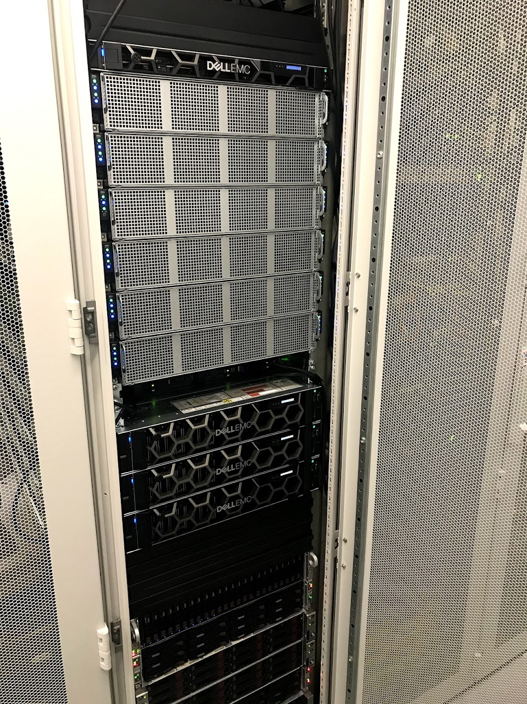
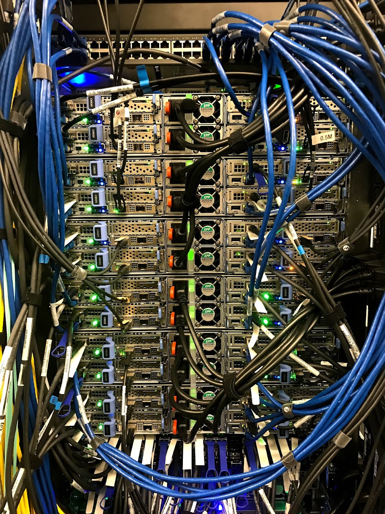
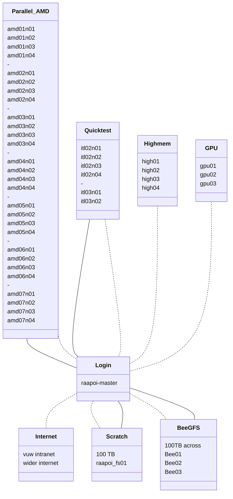
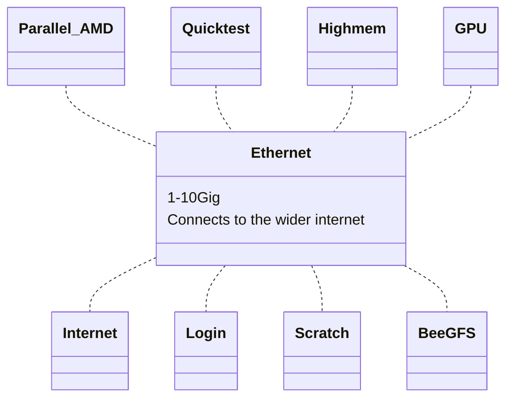
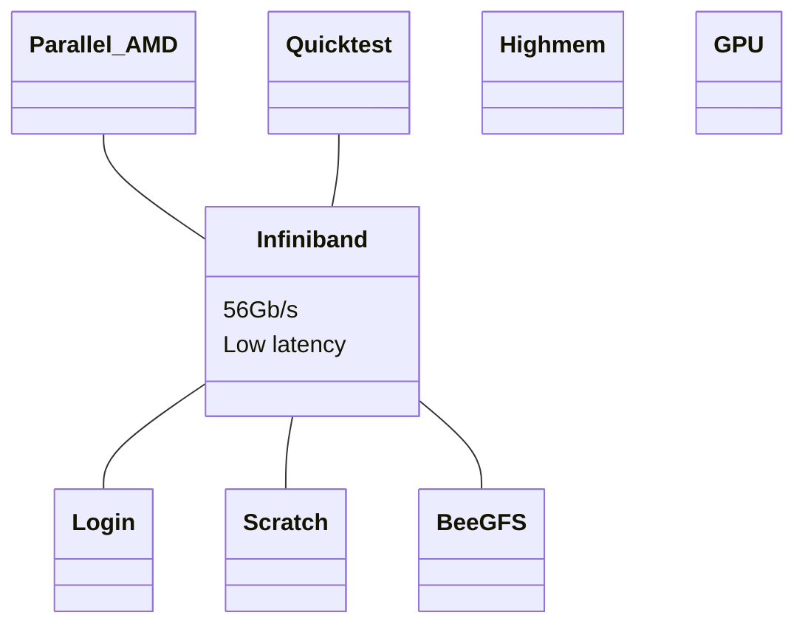

# HPC layout

> Note! Understanding the Rāpoi hardware layout is not critical for most users!  It is useful for users running big parallel MPI jobs and may be of interest to others.

To a first approximation a High Performance Computer (HPC) is a collection of large computers or servers (nodes) that are connected together.  There will also be some attached storage.

Rather than logging into the system and immediately running your program or code, it is organised into a job and submitted to a scheduler that takes your job and runs it on one of the nodes that has enough free resources (cpu and memory) to meet your job request.  Most of the time you will be sharing a node with other users.  

It is important to try and not over request resources as requested resources are kept in reserve for you and not available to others, even if you don't use them. This is particularly important when requesting a lot of resources or running array jobs which can use up a lot of the HPCs resources. 

## Hardware
On Rāpoi, the node you login into and submit your jobs to is called `raapoi-master`. 

The computers/servers making up the nodes are of several types, covered in [partitions](partitions.md).

Most of the processors in Rāpoi are in the parallel AMD nodes such as AMD01n01, AMD01n02 etc. Figures 1-4 show more details of these nodes.

<figure markdown>
{ align=left }
<figcaption>Figure 1: Example of some of the computers making up Rāpoi.  This is the front panel in Rack 4 in the Datacentre - highlighted is one of the AMD chassis, which have 4 nodes each. </figcaption>
</figure>

<figure markdown>
{ align=left }
<figcaption>Figure 2: Example of some of the computers making up Rāpoi.  This is the back in Rack 4 in the Datacentre.  Here you can clearly see the 4 nodes in each chassis of the parallel partition</figcaption>
</figure>

<figure markdown>
{ align=left }
<figcaption>Figure 3: An AMD compute node, one of 4 in a chassis.  The 2 black rectangles are the processor heatsinks, on each side are the ram modules. Each ram module is 32GB for a total of 512GB. On the lower left, the green circuit board is the the InfiniBand network card.  Opposite that, in black, is the 1.7TB NvMe storage we use as fast /tmp space. </figcaption>
</figure>

<figure markdown>
{ align=left }
<figcaption>Figure 4: One of the CPUs with the heatsink removed. At 115.00 x 165.00 mm, it is physically much larger than the processor in a desktop   Each AMD node has 2 of these 7702 processors.  Each processor has 64Cores/128Threads (with SMT - symmetric multi-threading - enabled) for a total of 128Cores/256Threads per node.</figcaption>
</figure>

## Network

On Rāpoi the nodes are connected to each other in two ways - via 10G ethernet and via 52G infiniband.  Most of the time you can ignore this, but it is important for interconnected jobs running across multiple nodes like weather simulations.

In figure 5 we can see the network layout of Rāpoi from the perspective of the Login node.  This is the node you ssh into, via the VUW intranet - either from a locally wired connection or via the VPN. The nodes are organised into groups mostly aligning with the [partition](partitions.md) the node is in.  

### Ethernet

The dashed lines indicate an Ethernet connection, all nodes are connected via ethernet at either 1G or 10G depending on the node.  Most of the intel nodes are only connected at 1G due to their age.  The newer nodes are all 10G connected.  The ethernet connection can also reach out into the wider internet for downloading updates, datasets etc.

### Infiniband

Many nodes are also connected by a solid line indicating an Infiniband network connection. This connection is faster than the ethernet connection but more importantly lower latency than the ethernet connection.  This helps with large interconnected (eg MPI) jobs running across multiple nodes.  The latency of the interprocess communication carried over the Infiniband link can have a dramatic affect on large scale calculations which for instance need to communicate grid boundary conditions across the nodes

Where infiniband is available, the scratch storage and BeeGFS storage is transmitted over the link as the latency helps with IO performance.

<figure>

<figcaption>Figure 5: Logical HPC layout from the perspective of the login node.  Solid lines indicate ethernet connections, dashed Infiniband</figcaption>
</figure>

Looking at the HPC from the perspective of the ethernet and infiniband networks.  The nodes in Figure 6 and 7 are the same as before, but we're just using the group container label to simplify the diagram.

<figure>

<figcaption>Figure 6: Logical HPC layout from the perspective of the ethernet connections.  Node layout is the same as in Figure 5, but only the group headings have been retained.
</figcaption>
</figure>

<figure>

<figcaption>Figure 7: Logical HPC layout from the perspective of the Infiniband connections. Note that not all nodes are connected via the infiniband link!  Node layout is the same as in Figure 5, but only the group headings have been retained.
</figure>

The Infiniband nodes are connected to one of two SX6036 Infiniband switches.  The intel and quicktest and login nodes are connected to one switch. Everything else is connected to the the other. The switches are broadly interconnected, but there is as small latency penalty for crossing the switch.