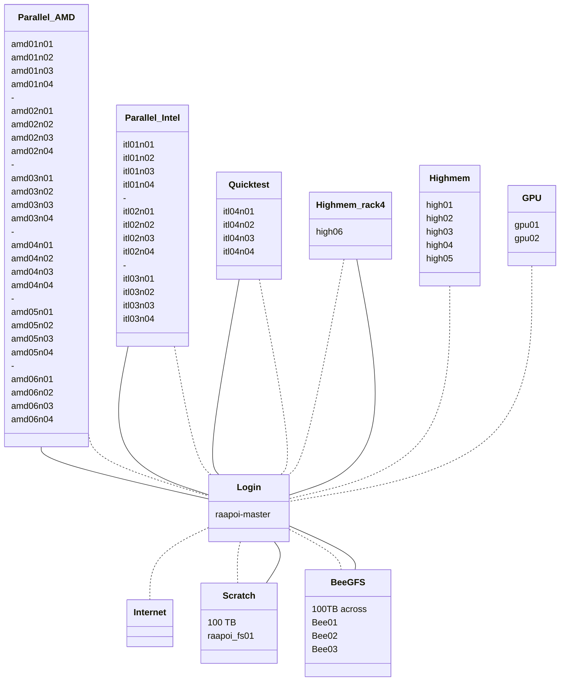
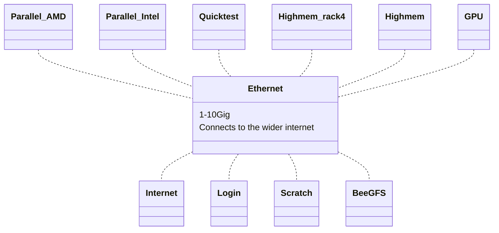
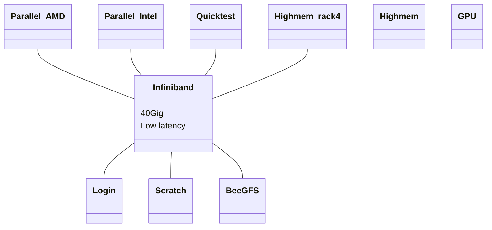

# HPC layout

To a first approximation a High Performance Computer (HPC) is a collection of large computers or servers (nodes) that are connected together.  There will also be some attached storage.

Rather than logging into the system and immediatly running your program or code, it is organsed into a job and submitted to a scheduler that takes your job and runs it on one of the nodes that has enough free resources (cpu and memory) to meet your job request.  Most of the time you will be sharing a node with other users.  

It is imporant to try and not over request resources as requested resourses are kept in reserve for you and not available to others, even if you don't use them. This is particularly important when requesting a lot of resoruces or running array jobs which can use up a lot of the HPCs resourses. 

On Rapoi the node you login into and submit your jobs to is called `raapoi-master`. 

On Rāpoi the nodes are connected to each other in 2 ways - via 10G ethernet and via 40G infiniband.  Most of the time you can ignore this, but it is important for interconnected jobs running accross multiple nodes like weather simulations.

The computers/servers making up the nodes are of serveral types, covered in [partitions](partitions.md).

<figure markdown>
{ align=left }
<figcaption>Figure 1: Example of some of the computers making up Rāpoi.  This is the front panel in Rack 4 in the Datacentre</figcaption>
</figure>

<figure markdown>
{ align=left }
<figcaption>Figure 2: Example of some of the computers making up Rāpoi.  This is the back in Rack 4 in the Datacentre.  Here you can clearly see the 4 nodes in each chassis of the parallal partition</figcaption>
</figure>

<figure>

<figcaption>Figure 1: Logical HPC layout from the perspective of the login node.  Solid lines indicate ethernet connections, dashed Infiniband</figcaption>
</figure>

<figure>

<figcaption>Figure 2: Logical HPC layout from the perspective of the ethernet connections. Node layout is the same as in Figure 1, but only the group headings have been retained.
</figcaption>
</figure>

<figure>

<figcaption>Figure 3: Logical HPC layout from the perspective of the Infiniband connections. Note that not all nodes are connected via the infiniband link!
</figcaption>
</figure>