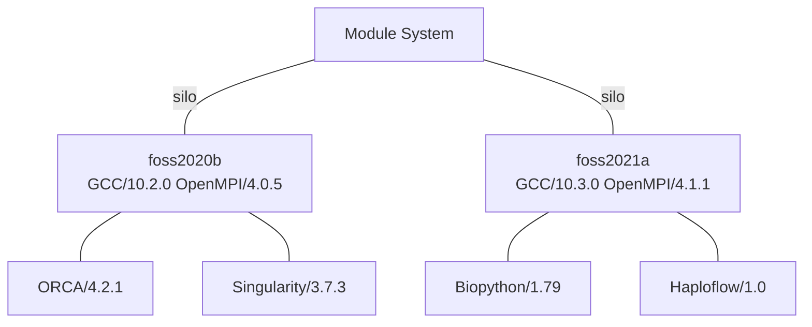

# New Module System

In 2020 we started building packages and organising them into modules[^1] in a new way.  In the new system modules are organised into "silos", each silo is a `compiler+MPI` version that was used to build the software.  You need to load the `compiler+MPI` version of most programs before that program is available for loading.

In general this restricts you to using using programs in one `compiler+MPI` "silo".  This is on the face of it, is annoying.  However, it resolves some very hard to diagnose and sometimes very subtle bugs that occurs when you load programs that are built with different compilers - in the old system this was not transparent to you.

To save you needing to load both a Compiler and MPI version, the compiler and MPI versions are bundled into half yearly packs.  For example `GCC/10.2.0 and OpenMPI/4.0.5` are bundled in the meta module `foss/2020b`

## Searching for Software

spider keyword, avail

## Adding or Loading Software

module, gcc and foss

## Add new module system for accounts prior to March 2022
Users accounts setup prior to March 2022

[^1]: 
    Modules are the way programs are packaged up for you to use.  We can't just install them system wide as we have hundreds of programs installed in modules, often with many versions of the same thing, they would conflict with each other.  Modules let you load just what you need. See [Preparing your enviroment](environment.md)