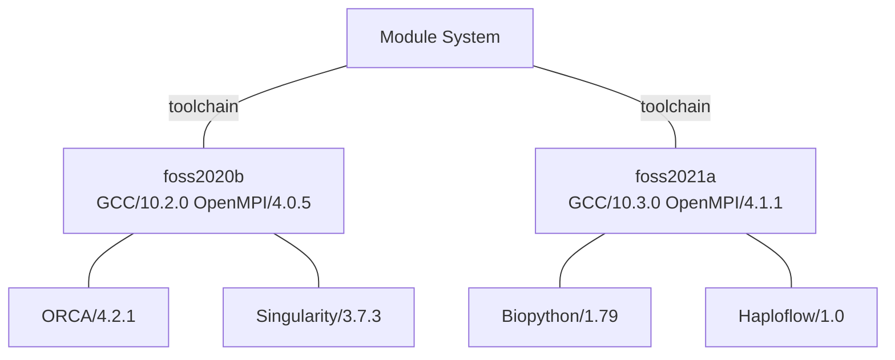

# New Module System

In 2020 we started building packages and organising them into modules[^1] in a new way.  In the new system modules are organised into toolchains[^2].  These toolchains were used to build the software. For most users the most important thing is these these toolchains act like software "silos". 

In general this restricts you to using using programs in one toolchain "silo".  This is on the face of it, is annoying.  However, it resolves some very hard to diagnose and subtle bugs that occur when you load programs that are built with different compilers - in the old system this was not transparent to you.

Before you module load a toolchain the software contained within will not be visible to module loading (except via module spider).  You first need to load the compiler and MPI version the software was built with. For example, if you wanted to load `BioPython/1.79` you would first need to load `GCC/10.3.0` and `OpenMPI/4.1.1`

To save you needing to load both a Compiler and MPI version, the compiler and MPI versions are bundled into half yearly packs.  For example `GCC/10.3.0 and OpenMPI/4.1.1` are bundled in the meta module `foss/2021a`




<br />

Example loading `BioPython/1.7.9`
```bash
# loading the modules
module load foss/2021a  # Needed for biopython to be loadable
module load BioPython/1.7.9
```

## Searching for Software with Spider

As the software is siloed into toolchains methods for finding software like `module avail` are less useful than in the old system - it will only show software loadable in the current toolchain silo, or if no toolchain silos are loaded it'll show you all the toolchains as well as software that's not tied to a toolchain.

We can use `module spider` to search for software modules more broadly - it will also show what toolchain needs to be loaded first.

If we wanted to load a version of netCDF, we could search for it with spider.  Note spider searches in a case sensitive manner - but it will suggest other capitalisation if other search options exist.
```bash
module spider netCDF
```

This returns a lot of information, but the important bit is:
```bash

-------------
  netCDF:
-------------
    Description:
      NetCDF (network Common Data Form) is a set of software libraries
      and machine-independent data formats that support
      the creation, access, and sharing of array-oriented scientific
      data. 

     Versions:
        netCDF/4.7.1
        netCDF/4.7.4
        netCDF/4.8.0

--------------
  For detailed information about a specific "netCDF" module (including
  how to load the modules) use the modules full name.
  For example:

     $ module spider netCDF/4.7.1
--------------
```

We have 3 versions of netCDF available in the new module system, `4.7.1`,`4.7.4` and `4.8.0`.  To see which toolchain needs to be loaded, we spider that particular version
```bash
module spider netCDF/4.7.1

#returns
----------
  netCDF: netCDF/4.7.1
----------
    Description:
      NetCDF (network Common Data Form) is a set of software libraries 
      and machine-independent data formats that support
      the creation, access, and sharing of array-oriented scientific
    data. 

    You will need to load all module(s) on any one of the lines below 
    before the "netCDF/4.7.1" module is available to load.

      GCC/8.3.0  OpenMPI/3.1.4
 
    Help:
      
      Description
      ===========
      NetCDF (network Common Data Form) is a set of software libraries 
       and machine-independent data formats that support the creation,
       access, and sharing of array-oriented 
       scientific data.
      
      
      More information
      ================
       - Homepage: https://www.unidata.ucar.edu/software/netcdf/
```

This gives some information about the software as well as what we need to load it, in this case `GCC/8.3.0` and `OpenMPI/3.1.4`.  We can just use that and load netcdf -
```bash
#Load prerequisites - the "silo"
module load GCC/8.3.0
module load OpenMPI/3.1.4

#Load NetCDF
module load netCDF
```

Alternatively you could load the toolchain containing `gcc/8.3.0` and `OpenMPI/3.1.4` - `foss/2019b`
```bash
#Load prerequisites - the "silo"
module load foss/2019b

#Load NetCDF
module load netCDF
```


## Toolchain "silo" table

Toolchains currently on Rāpoi as of May 2022.

Toolchain  | Compiler   | MPI           |
:---------:|:----------:|:--------------:
foss/2018b | GCC/7.3.0  | OpenMPI/3.1.1 |
foss/2019b | GCC/8.3.0  | OpenMPI/3.1.4 |
foss/2020a | GCC/9.3.0  | OpenMPI/4.0.3 |
foss/2020b | GCC/10.2.0 | OpenMPI/4.0.5 |
foss/2021a | GCC/10.3.0 | OpenMPI/4.1.1 |

There are also toolchain versions with CUDA for use on the GPU nodes - they contain the same compiler and OpenMPI but also include a CUDA version


Toolchain  | Compiler   | MPI           | CUDA
:---------:|:----------:|:-------------:|:--------------:
fosscuda/2019b | GCC/8.3.0  | OpenMPI/3.1.4 | CUDA/10.1.243
fosscuda/2020b | GCC/10.2.0 | OpenMPI/4.0.5 | CUDA/11.1.1

Lastly we have some intel compiler toolchains built.  This *might* work on the AMD nodes, but you'll have an easier time with the intel nodes.

Toolchain     | Compiler   | Intel Compiler | MPI           | MKL 
:------------:|:----------:|:--------------:|:-------------:|:-------------:
intel/2021b   | GCC/11.2.0 | 2021.4.0       | impi/2021.4.0 | imkl/2021.4.0
intel/2022.00 | GCC/11.2.0 | 2022.0.1       | impi/2021.5.0 | imkl/2022.0.1 

You can also just experimentally module load the various toolchains and list to see what the module loads to see what it contains.
<pre><code>
#load toolchain
module load foss/2020b

# List what it loads
module list

# Returns
Currently Loaded Modules:
  1) config           6) libfabric/1.11.0  11) libxml2/2.9.10     16) FFTW/3.3.8
  2) GCCcore/10.2.0   7) libevent/2.1.12   12) libpciaccess/0.16  17) OpenBLAS/0.3.12
  3) binutils/2.35    8) numactl/2.0.13    13) hwloc/2.2.0        18) ScaLAPACK/2.1.0
  4) <b>GCC/10.2.0</b>       9) XZ/5.2.5          14) PMIx/3.1.5         19) foss/2020b
  5) UCX/1.9.0       10) zlib/1.2.11       15) <b>OpenMPI/4.0.5</b>
</pre>


## Add new module system for accounts prior to March 2022
Users accounts setup prior to March 2022 will not automatically have the new module system loaded. You can automatically use this new module system (in parallel with the old one) by adding a line to your `.bashrc` file.  Users of zsh can make a similar change to their .zshrc file.

Login to Rāpoi and backup your `.bashrc` file, then edit it to add the needed line in.

```bash
cd ~  # change to your home directory
cp .bashrc .bashrc_backup #create backup of your bashrc file

nano .bashrc  #open the nano editor to edit your file

#in nano find the line 
# module use -a /home/software/tools/modulefiles
# it will be near the end of the file.  After that line, add the line:
module use /home/software/tools/eb_modulefiles/all/Core

#press control-x to exit nano.  It will ask if you want to save the modified buffer.  Type Y to save the change.  
# It'll ask for the filename, just press enter to accept the name
# .bashrc
```

After you have made that change logout and log back in to have the new module system loaded.  You can test it's working by loading a toolchain.
```bash
module load foss/2020a
```

If you run into problems, copy your .bashrc backup back to the original and try again with
```bash
cp .bashrc_backup .bashrc
```

Also feel free to ask for help on slack


[^1]: 
    Modules are the way programs are packaged up for you to use.  We can't just install them system wide as we have hundreds of programs installed in modules, often with many versions of the same thing, they would conflict with each other.  Modules let you load just what you need. See [Preparing your environment](environment.md)

[^2]:
    The toolchain is comprised of a compiler and a version of MPI that was used to build the software.  For instance the toolchain foss/2021a uses GCC/10.3.0 and OpenMPI/4.1.1
