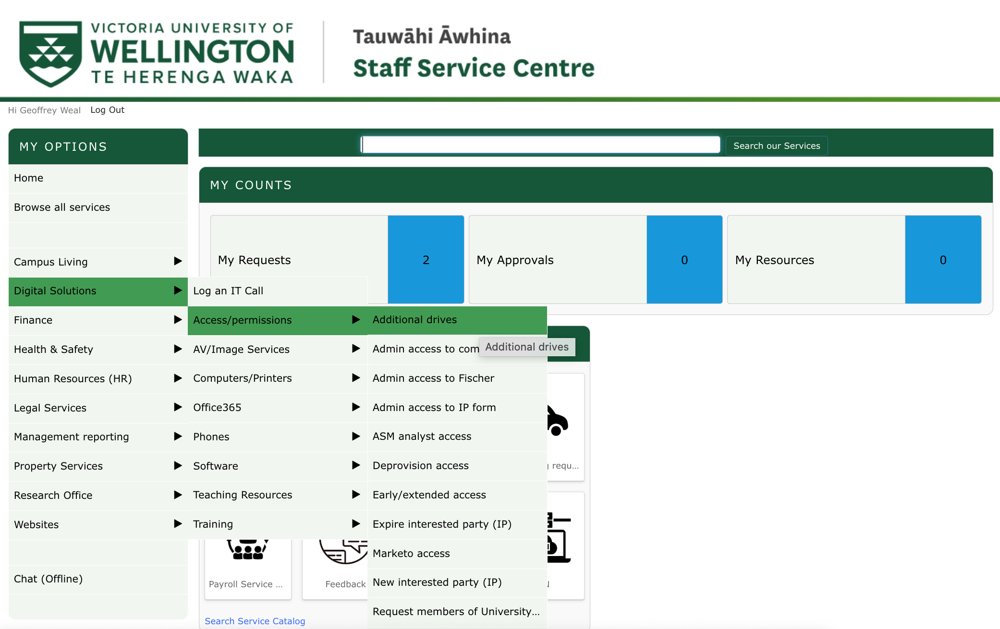
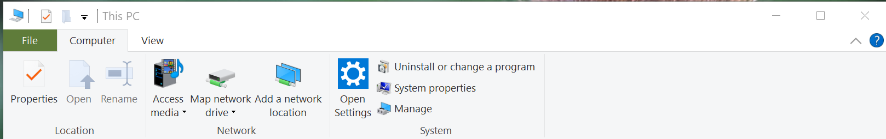
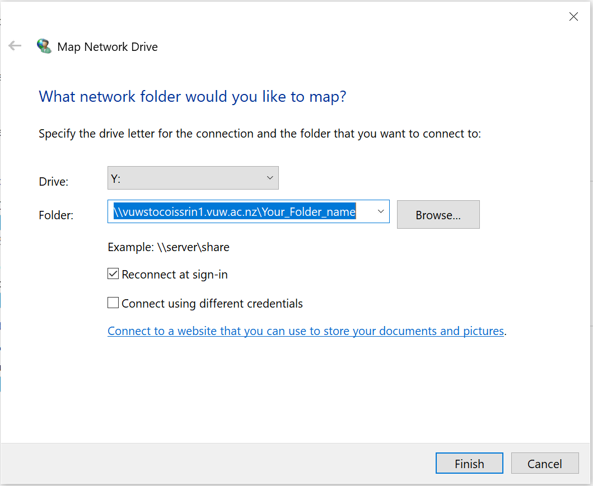
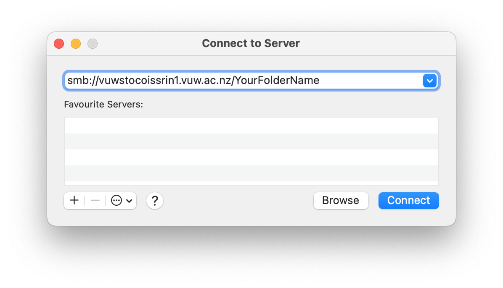

# Storage for Learning and Research (SoLAR) - VUW High Capacity Storage

The SoLAR Drive is the VUW High Capacity Storage system, allowing you to store all your research work. You can require many many terabytes of storage. It is also possible to connect your SoLAR drive to Rāpoi, which is great!

The following document will describe how to sign up for storage on the SoLAR Drive, as well as how to move and copy data between Rāpoi and your SoLAR Drive. 


## Signing up and getting storage on SoLAR

To get your own space on SoLAR. Do the following:

1. Login to your staff intranet. To do this, open https://intranet.wgtn.ac.nz/ in your web browser, and sign in to your staff intranet. 
2. In a new browser tab, open https://intranet.wgtn.ac.nz/staff/services-resources/digital-solutions/contact-us
3. You should see the follow page below. Click the **Staff Service Centre** button


<ol start="4">
  <li>You will now be directed to the Staff Service Centre, which will look like below. Hover your mouse above <b>Digital Solution -> Access/permissions -> Additional drives</b></li>
</ol>



<ol start="5">
  <li>You will now be sent to the <b>ADDITIONAL DRIVE ACCESS</b> page. Fill out the details on this page and click the **Submit** button at the bottom of the page to send your request space on SoLAR.</li>
</ol>

Source: [https://intranet.wgtn.ac.nz/staff/services-resources/digital-solutions/research-services/solar](https://intranet.wgtn.ac.nz/staff/services-resources/digital-solutions/research-services/solar)


## Accessing your SoLAR Drive on Windows/Mac

### Accessing the SoLAR Drive from off Campus

You will want to sign up to the Uictoria University VPN to gain access to SoLAR. Click [https://vpn.vuw.ac.nz/](https://vpn.vuw.ac.nz/) to get access to the VPN and to download the Cisco AnyConnect program on to your computer

### Windows

1. Open **This PC (My Computer)** and click **Computer -> Map network drive** at the top of the This PC explorer window.



<ol start="2">
  <li>This will open a window as shown below. Enter the SoLAR path and the name of your patition on SoLAR, and click the <b>Finish</b> button.</li>
</ol>



<ol start="2">
  <li>Enter in your username as <b>STAFF\username</b> and your password if required</li>
</ol>

### Mac

1. If you are off campus, login to your VPN using the Cisco AnyConnect program.
2. In Finder, click **Go -> Connect to Server...**
3. Write ``smb://vuwstocoissrin1.vuw.ac.nz/YourFolderName`` into the box, where ``YourFolderName`` is the name of your partition on SoLAR, and click connect.



<ol start="4">
  <li>In username give: ``STAFF/username``; give your VUW password, and click connect.</b></li>
</ol>


## Moving/Copying files and folders between SoLAR and Rāpoi

There are several way to move/copy files and folder between SoLAR and Rāpoi


### Best Way: Mounting SoLAR Partition in Rāpoi

Ask Digital Solutions for a service account to be created against your Research storage.  Then a Raapoi admin will permanantly mount your storage on Raapoi - this process is time consuming and involves back and forth between DS and CAD. 

### Second Way: ``RClone``

**To do once I get it fixed**


### Third Way: ``smbclient``

``smbclient`` is specifically designed to transfer files and folders to and from smb clients. It is a bit cumbersome to use, but it is an alternative way for copying files between Rāpoi and SoLAR

To use ``smbclient``, first ``cd`` into the directory that contains the folder you would like to copy from Rāpoi to SoLAR. Then in the terminal give the following input:

```console
smbclient //vuwstocoissrin1.vuw.ac.nz/SoLAR_folder_name --user username --workgroup STAFF --command "prompt OFF; recurse ON; cd remote/target/directory; mput folder_on_Raapoi_you_want_to_copy_to_SoLAR "
```

You will then be asked to give your VUW password to copy data to SoLAR.

This may take a while if you are copying lots of files or large files. It is recommended that if you have lots of file in folders to copy (i.e. in the 100,000s of files) that you copy individually big folders rather than the whole directory at once so you can keep track of what has been copied if there are issues. 

**Note**: You may see it not doing anything for a while, and then all of a sudden it will show you that it is doing things. This is normal. 

If you want to copy files from SoLAR to Rāpoi, first ``cd`` into the directory on Rāpoi that you want to copy the SoLAR folder/file to. Then in the terminal give the following input:

```console
smbclient //vuwstocoissrin1.vuw.ac.nz/SoLAR_folder_name --user username --workgroup STAFF --command "prompt OFF; recurse ON; cd remote/source/directory; mget folder_on_SoLAR_you_want_to_copy_to_Raapoi "
```

**Warning** 
Don't run multiple ``smbclient`` at once, only a few at a time, if not one at a time. It can have problems if too many are running at one time. 


