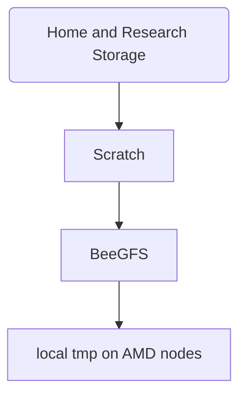

# Storage and quotas

## Shared Storage
Currently users have 3 main storage areas share across every node.  Each node has access to to this storage at all times and data is shared.  Be careful with parallel jobs trying to write to the same filename!

* __/nfs/home/USERNAME__ - This is your Home Directory, each user has a *50 GB* quota limit. The data is replicated off site and backed up regularly by Digital Solutions. [Home directory tips](storage/home.md)

* __/nfs/scratch/USERNAME__ - This is your scratch space, each user has a *5 TB* quota limit. This data is *not backed up!*  [Scratch directory tips](storage/scratch.md)

* __/beegfs-volatile/USERNAME__ - This is fast parallel filesystem.  There is no quota enforcement here.  There is 100TB of total space. This data is *not backed up!* **All data on this storage is periodically deleted** 
[BeeGFS tips](storage/beegfs.md)

Note: Home directory quotas cannot be increased, however if you need more space in your scratch folder let us know.

To view your current quota and usage use the _vuw-quota_ command, for example:

```bash
<username@raapoi-master:~$ vuw-quota 

User Quotas

                       Storage  Usage (GB)  Quota (GB)     % Used 
            /nfs/home/<username>      18.32       50.00     36.63%

         /nfs/scratch/<username>       0.00     5000.00      0.00%

```

## Per Node Storage

Each node has local storage you can use at ```/tmp```.  This storage is **not shared** so a program running on ```amd01n02``` will not be able to see data stored on node ```amd01n04```'s ```/tmp``` storage.

On the AMD nodes and GPU nodes this is very fast nvme storage with 1.7TB total space.  On the Intel and highmem nodes this storage is slower and 1.7TB is not always available.

If you use this storage it is your responsibility to copy data to the ```/tmp``` and **clean it up** when your job is done.  For more info see [Temp Disk Tips](storage/tmp.md).

## Storage Performance 
<figure>

<figcaption>Figure 1: Storage speed hierarchy. The slowest storage is your user home directory as well as any mounted research storage.  The trade off for this is that this data is replicated off site as well as backed up by Digital Solutions.   The fastest is the local tmp space on the AMD nodes - it is usually deleted shortly after you logout and only visible to the node it's on, but it is extremely fast with excellent IO performance.
</figcaption>
</figure>