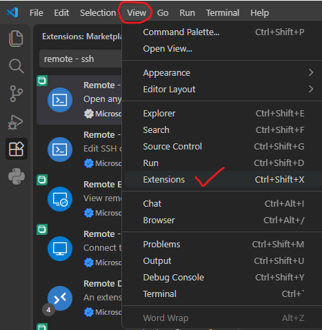
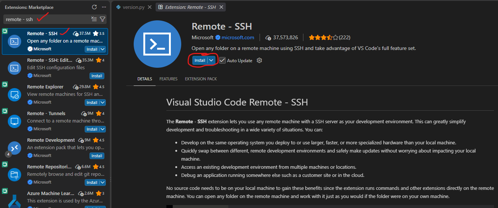

## VSCode (Page Under Construction)

!!! Tip
    Windows users are recommended to use Windows Terminal (Powershell) in Windows 11 or [`Git Bash`](https://git-scm.com/downloads) for the following instructions to work. 

**Running VSCode on the login node is not allowed. It should always be run on a compute node using the instructions below. Before connecting, check whether you really need to use VSCode on Rāpoi or whether it would be better to run it locally on your own machine.**

The instructions below should let users run their VSCode session on a compute node. 

**Step 1**. Download and install Microsoft Visual Studio Code from https://code.visualstudio.com/download.

**Step 2**. Install  `Remote - SSH` extension.

- Open VSCode, click "View" and then "Extensions" as shown in the image below.



- Then on the left side in search bar, type "Remote - SSH" and select the first result as shown in image. Then click Install on right side as shown by a red circle on the image.



**Step 3**. Now you need to create ssh keys on your local machine, _(existing ssh keys can also be used - no need to create new ones)_ and upload them on Rāpoi. The detailed instructions for creating the ssh keys are given below:

- If you are a Windows user, click on start and search for "Terminal" or "PowerShell" and open it. Mac users can open mac terminal.
- Type `cd` and press Enter key to go to the user's home directory. My username is `ali` in the exxample below:

```bash
C:\Windows\System32> cd
```

- Then enter into `.ssh` directory by typing

```bash
C:\Users\ali> cd .ssh
```

- Now type ssh-keygen and press Enter.

```bash
C:\Users\ali\.ssh> ssh-keygen
```

- Follow the prompts on the terminal to generate ssh-key pair. When it asks for the file to save the key, you can give a different name, otherwise you can keep the default one i.e., `id_ed25519`. 

```bash
C:\Users\ali\.ssh> ssh-keygen
Generating public/private ed25519 key pair.
Enter file in which to save the key (C:\Users\ali/.ssh/id_ed25519):
Enter passphrase (empty for no passphrase):
Enter same passphrase again:
Your identification has been saved in C:\Users\ali/.ssh/id_ed25519
Your public key has been saved in C:\Users\ali/.ssh/id_ed25519.pub
The key fingerprint is:
SHA256:Dc7PcRDKmdKDETrX0+FK7B1IizHxxMP1C2jdOEr3HH8 ali@mypc
```

- If you type `ls`, you 'll see two files, `id_ed25519` and `id_ed25519.pub` in the current directory. We need to upload the public key `id_ed25519.pub` to Rāpoi.


- Send the _public_ key to _Rāpoi_
    - For macOS and Linux users, or Windows users using Git Bash when already inside the `.ssh` directory, replace `RAAPOI_USERNAME` with your actual Rāpoi username:

        ```bash
        user@local:~$ ssh-copy-id -i id_ed25519 RAAPOI_USERNAME@raapoi.vuw.ac.nz
        ```

    - For Windows users using Windows Terminal or PowerShell, replace `RAAPOI_USERNAME` with your actual Rāpoi username:

        ```bash
        C:\Users\ali\.ssh> type .\id_ed25519.pub | ssh RAAPOI_USERNAME@raapoi.vuw.ac.nz "mkdir -p ~/.ssh && cat >> ~/.ssh/authorized_keys"
        ```

**Step 4**. Now its the time to test the new ssh keys. Try logging in as shown below and it should not ask you for your Rāpoi password.

For mac and Linux users or Windows users using GitBash
```bash
user@local:~$ ssh -i ~/path/to/public/key RAAPOI_USERNAME@raapoi.vuw.ac.nz
```
For Windows Users (using Windows Terminal or Powershell).
```bash
C:\Users\ali\.ssh> ssh -i id_ed25519 RAAPOI_USERNAME@raapoi.vuw.ac.nz
```

If it logs in successfully, it means that the ssh keys are working correctly.

**Step 5**. Now you need to update `ssh config` file on your local machine.

Create `~/.ssh/config` file if it does not exist. Add hostname details to it:

```bash
Host VSCode_Compute
    User <YOUR_RAAPOI_USERNAME>
    HostName amd01n01
    ProxyJump raapoi_login

Host raapoi_login
    HostName raapoi.vuw.ac.nz
    User <YOUR_RAAPOI_USERNAME>

Host *
    ForwardAgent yes
    ForwardX11 yes
    ForwardX11Trusted yes
    IdentityFile ~/.ssh/id_rsa # Add your own private key path here
    AddKeysToAgent yes
    StrictHostKeyChecking no
    UserKnownHostsFile /dev/null
```

Step 5. On your local machine, open a terminal window and login to _Rāpoi_ normally 

```bash 
user@local:~$ ssh raapoi_login
```

Once logged in alloc resources for the VSCode session
```bash 
RAAPOI_USERNAME@raapoi-login:~$ srun -t0-01:00:00 -wamd01n01 --mem=4G --pty bash
```

!!! Tip
    Extend the time to maximum 5 hours with `-t0-04:59:59`

Step 6. Connect VSCode session 

Open VSCode window, and click on the bottom left corner that says `Open a Remote Window`, and then choose `Connect to Host` and then selecting `VSCode_Compute` as a host. 

Once a connection is established, your VSCode session should be running on a compute node now. 

!!! Tip

    To speed up VSCode, there are steps mentioned in [the official VSCode docs](https://code.visualstudio.com/docs/configure/settings). Below is just a part of it: 

    Once connected, update VSCode's `/nfs/home/$USER/.vscode-server/data/Machine/settings.json`, and add the following lines to it:

    ```bash
    {
        "files.watcherExclude": {
            "**":true,
        },
        "files.exclude": {
            "**/.*": true,
        },
        "search.followSymlinks":false,
        "search.exclude": {
            "**":true,
        },
        "terminal.integrated.inheritEnv": false,
    }
    ```

    


Step 7. To close VSCode session. 

Go to `File` > `Close Remote Connection`

!!! Tip
    The instructions above assume that the node amd01n01 is up and has sufficient resources available. There may be times when this is not the case and you need to adapt these steps to access cpus on a different node. As a workaround you'll need to modify steps 4 and 5 to point towards a different node. If you do, you should make a note to revert these changes to utilise amd01n01 once it is available again.

